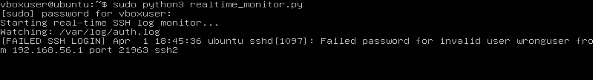
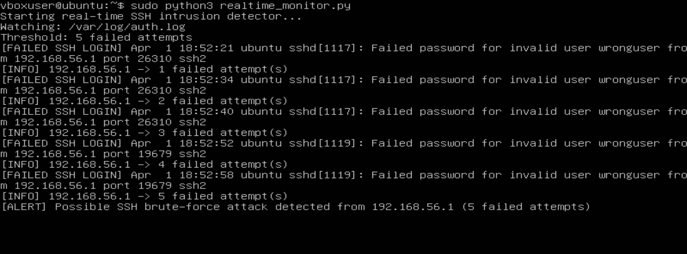
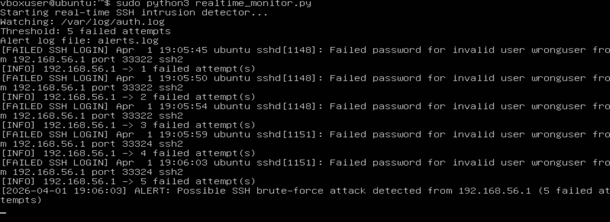
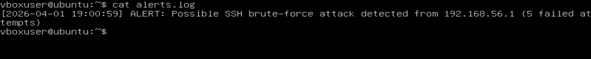
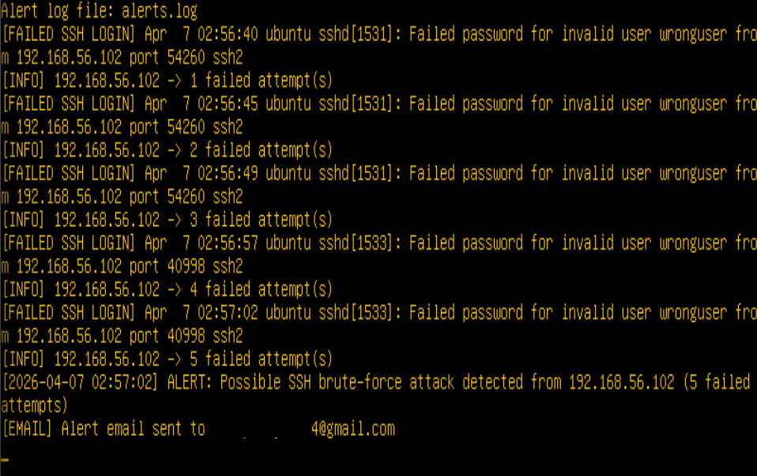
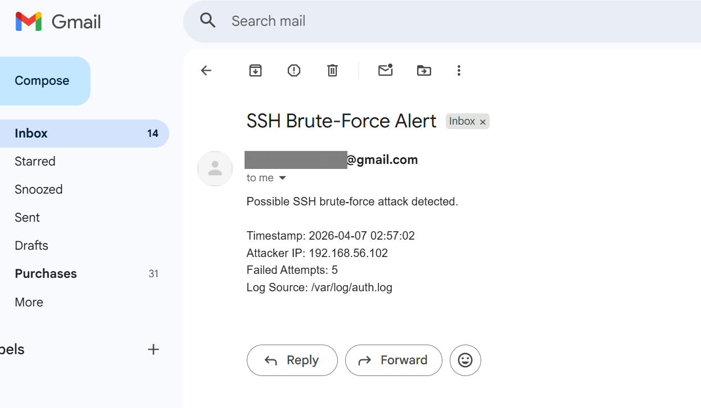

# Real-Time-SSH-Detection-and-Alerting-System
Real Time SSH Detection and Alerting System

# Real-Time SSH Detection and Alerting System

A real-time intrusion detection system (IDS) that monitors SSH authentication logs, detects brute-force attacks, and triggers automated alerts with email notifications.

---

## Overview

This project simulates a **Security Operations Center (SOC) workflow** by implementing:

- Continuous log monitoring  
- Detection of suspicious activity  
- Threshold-based alerting  
- Incident logging  
- Real-time email notifications  

The system detects repeated failed SSH login attempts and responds instantly, mimicking how modern SIEM tools operate.

---

## Features

- 🔍 Real-time monitoring of `/var/log/auth.log`  
- 🚫 Detection of failed SSH login attempts  
- 📊 IP-based attempt tracking  
- 🚨 Threshold-based brute-force detection  
- 📝 Persistent alert logging (`alerts.log`)  
- 📧 Automated email notifications  
- ⚡ Lightweight Python implementation  

---


---

## Technologies Used

- Python 3  
- Ubuntu Server  
- Kali Linux  
- Hydra  
- SMTP (Gmail)  
- VirtualBox  

---

## How It Works

1. Monitors `/var/log/auth.log` in real-time  
2. Detects `"Failed password"` entries  
3. Extracts attacker IP  
4. Tracks failed attempts per IP  
5. Triggers alert when threshold is reached  
6. Logs the alert  
7. Sends email notification  

---

##  Screenshots

###  Real-Time Log Monitoring


###  Threshold Detection


###  Alert Trigger


###  Alert Log File


###  Email Sent Confirmation


###  Email Alert Received


---

##  Setup

### 1. Clone Repo

```bash
git clone https://github.com/yourusername/realtime-ssh-detection.git
cd realtime-ssh-detection
